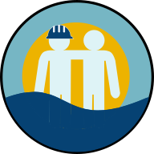

<p align="center">

</p>

# Marine Scheduler API


A REST API for registering your work shifts and sharing with friends.

Web App is available at https://seamates.herokuapp.com.

You can check the API documentation live at https://seamates.herokuapp.com/swagger-ui.html.


## Motivation
The inspiration for this project comes from the frustration of never knowing when your seafarer friends will be
available for events, having to constantly message them to get this information. With the website, messaging is no
longer necessary: the seafarer will fill his or her shift on the app and his friends will have access to those shifts.


## Project Description
The project uses Spring's IoC feature to implement an onion architecture.

The persistence layer leverages Spring Data JPA abstraction capability to heavily reduce boilerplate while keeping loose
coupling between the app and the databases themselves. This allows for easily changing between a SQL or NoSQL datasource,
depending on the future needs of the project.

The presentation layer avoids information exposure by the mixed use of DTOs and JsonViews. Furthermore, the API is
coupled with the SeaMates web app, using Spring MVC for deploying the app to the browser and some basic redirection.
Routing and rendering is done client-side.

Security is achieved by JWTs, delegating to the client the responsibility of storing its tokens and sending them with
every request. Once expired, the token can be refreshed, where it will be checked against a Redis whitelist that is
cleared on logout. There is also support for OAuth2 authentication and signup.

Testing is done extensively, including unit, web-layer and integration tests with in-memory databases. It is also
deployed to a test environment in the same cloud provider from the production one for manual testing and full database
integration.

The project also features CI/CD pipelines using GitHub Actions for testing, building and deploying to the current cloud
provider.


## Getting Started
For building the project, make sure you have:
- [Maven](https://maven.apache.org/download.cgi) (at least 3.6.3)
- [Redis](https://redis.io) (at least 6.2.3)
- [PostgresSQL](https://www.postgresql.org/) (or any other SQL database - may need extra configuration)

You will also have to set the following environment variables:
```sh
SPRING_DATABASE_URL
MAIL_USERNAME
MAIL_PASSWORD
JWT_SECRET
FACEBOOK_ID
FACEBOOK_SECRET
REDIS_URL
PORT
```

### Building with Docker
1. Clone this repository.

2. `cd` into the project root.

3. Build with Maven:

   `mvn clean package`

4. Create a docker image from the project's Dockerfile:

   `docker build -t <YOUR_IMAGE_NAME> .`

5. Run the docker image with the environment variables you have set above. In this case, I have put them on a file
   called `env.list`. The `--net=host` flag allows us to use a local database listening on the host's port:

   `docker run --env-file env.list --net=host <YOUR_IMAGE_NAME>`

6. Done! You can start sending HTTP requests to http://localhost:<PORT>/api, or going to http://localhost:<PORT>/ in
   your browser and checking the web app.


### Building with Maven
1. Make sure you have [JDK 11](https://www.oracle.com/java/technologies/javase-downloads.html)

2. Clone this repository.

3. `cd` into the project root.

4. Run the following command:
```sh
mvn spring-boot:run
```

6. Done! You can start sending HTTP requests to http://localhost:PORT/api, or going to http://localhost:PORT/ in
   your browser and checking the web app.


## Features
- Work shift registering and monitoring
- Requesting, accepting and deleting friendships
- Work shift calendar - know when your friends are available
- Facebook login and signup
- Push notifications - be alerted of your friends in real time  
- Account recovery
- Responsive web app


## Tech Stack
- [Spring Boot](https://spring.io/projects/spring-boot)
- [Spring Security](https://spring.io/projects/spring-security)
- [Spring Data JPA](https://spring.io/projects/spring-data-jpa)
- [Spring HATEOAS](https://spring.io/projects/spring-hateoas)
- [Redis](https://redis.io)
- [Docker](https://www.docker.com/)
- [Java JWT](https://github.com/auth0/java-jwt)
- [Springdoc-openapi](https://springdoc.org/)
- [Lombok](https://projectlombok.org/)
- [PostgreSQL](https://www.postgresql.org/)
- [Formik + Yup](https://formik.org/)
- [React](https://reactjs.org/)
- [Material-UI](https://material-ui.com/)


## Contributing
This project is also for study purposes, so feel free to make suggestions, open issues, fork or submit a pull request.

## License
[GPL-3.0](COPYING)
